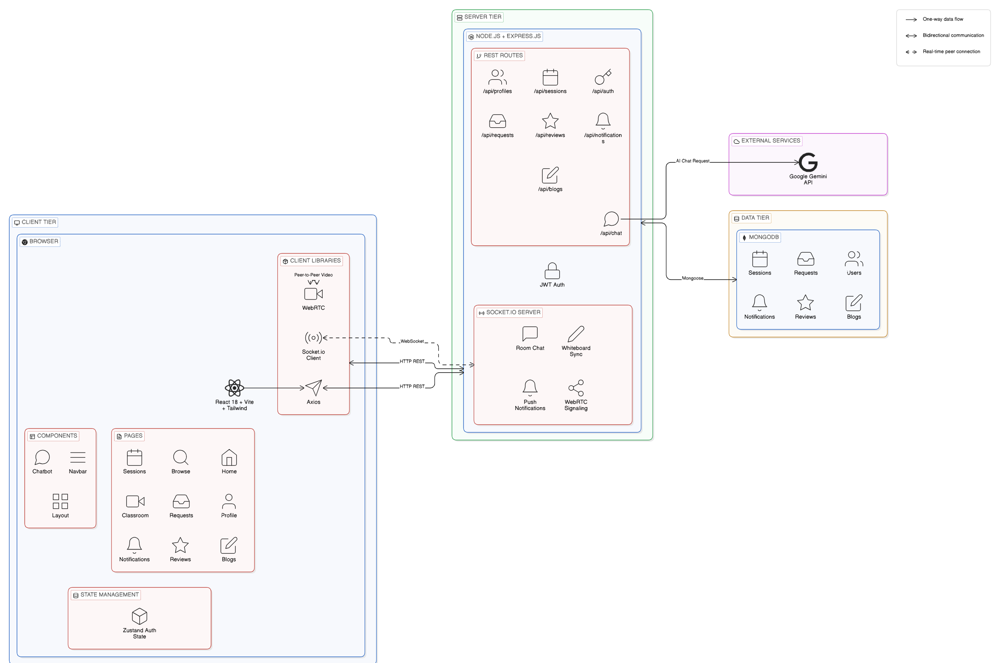

# SkillConnect 🎓

**SkillConnect** is a full-stack peer-to-peer skill-sharing platform that connects people who want to teach with people who want to learn. Users can list their skills, browse others, schedule live sessions, and collaborate in real-time — all in one place.

<!-- 🌐 Live Demo: [Add deployed link here] -->

---

## 📸 Screenshots


| Home Page | Browse Skills |
|-----------|---------------|
|  |  |

| Live Classroom | User Profile |
|----------------|--------------|
|  |  |

---

<!--## 🎬 Video Demo-->


<!-- [](https://your-video-link-here) -->

---

## ✨ Why SkillConnect?

- **Learn from peers, not just courses** — connect directly with people who have the skills you need.
- **Teach and earn reputation** — share your knowledge, get reviewed, and build a credible profile.
- **Real-time collaboration** — live classrooms come with video (WebRTC), whiteboard, and chat built in.
- **AI-powered assistant** — an integrated chatbot (powered by Gemini/OpenAI) helps users navigate and get answers instantly.
- **Full session lifecycle** — from requesting a skill → booking a session → joining a classroom → leaving a review, everything is handled end-to-end.
- **Instant notifications** — stay updated on requests, session changes, and messages in real time via Socket.io.

---

## 🚀 Features

- 🔐 JWT authentication with secure bcrypt password hashing
- 👤 User profiles with skills, bio, and reviews
- 🔍 Browse and search skill providers
- 📅 Create, manage, and join learning sessions
- 📬 Send and respond to skill requests
- 🎥 Live Classroom with WebRTC video, shared whiteboard & real-time chat
- 🤖 AI Chatbot assistant (Google Gemini / OpenAI)
- ⭐ Review and rating system
- 🔔 Real-time notifications
- 📝 Community blog section

---

## 🏗️ System Architecture



The app follows a **3-tier architecture**:

- **Client Tier** — React frontend communicates with the server via REST (Axios) and WebSocket (Socket.io). WebRTC handles peer-to-peer video directly between users in the Classroom.
- **Server Tier** — Express.js processes API requests, manages JWT auth, handles all Socket.io events (chat, whiteboard, signaling, notifications), and calls the Google Gemini API for the AI chatbot.
- **Data Tier** — MongoDB stores all persistent data via Mongoose (Users, Sessions, Requests, Reviews, Notifications, Blogs).

---
## 🛠️ Tech Stack

| Layer | Technology |
|-------|------------|
| **Frontend** | React 18, Vite, Tailwind CSS|
| **Backend** | Node.js, Express.js |
| **Database** | MongoDB with Mongoose |
| **Real-time** | Socket.io, WebRTC |
| **Auth** | JWT + bcrypt |
| **AI** | Google Gemini API|
| **Validation** | Zod, express-validator |

---

## 📁 Project Structure

```
SkillConnect/
├── backend/
│   └── src/
│       ├── config/        # DB connection
│       ├── middleware/    # JWT auth middleware
│       ├── models/        # Mongoose schemas (User, Session, Request, Review…)
│       ├── routes/        # REST API routes
│       ├── services/      # Socket service
│       └── server.js      # Entry point
│
└── frontend/
    └── src/
        ├── api/           # Axios instance & Socket.io setup
        ├── components/    # Navbar, Footer, Layout, Chatbot
        ├── pages/         # All route-level pages
        ├── store/         # Zustand auth store
        └── App.jsx        # Route definitions
```

---

## ⚙️ Getting Started

### Prerequisites

- Node.js v18+
- MongoDB (Atlas or local)

### 1. Clone the repository

```bash
git clone https://github.com/your-username/SkillConnect.git
cd SkillConnect
```

### 2. Setup the Backend

```bash
cd backend
npm install
cp .env.example .env
```

Fill in your `.env`:

```env
PORT=5000
MONGODB_URI=your_mongodb_connection_string
JWT_SECRET=your_jwt_secret
NODE_ENV=development
```

```bash
npm run dev
```

### 3. Setup the Frontend

```bash
cd frontend
npm install
npm run dev
```

> 🪟 **Windows users:** Use the included `.bat` scripts — `install-backend.bat`, `run-backend.bat`, `install-frontend.bat`, `run-frontend.bat`.

The app will be available at `http://localhost:5173` by default.

---

## 🔌 API Overview

| Method | Endpoint | Description |
|--------|----------|-------------|
| POST | `/api/auth/register` | Register a new user |
| POST | `/api/auth/login` | Login and get JWT |
| GET | `/api/profiles` | Browse all user profiles |
| GET/POST | `/api/sessions` | List or create sessions |
| GET/POST | `/api/requests` | Manage skill requests |
| GET | `/api/notifications` | Get user notifications |
| GET/POST | `/api/reviews` | Reviews for a user |
| GET/POST | `/api/blogs` | Community blog posts |
| POST | `/api/chat` | AI chatbot endpoint |

---

## 🤝 Contributing

Contributions are allowed and always welcome! Whether it's fixing a bug, suggesting a feature, improving docs, or anything in between — feel free to open an issue or submit a pull request. Every contribution, big or small, is appreciated.

1. Fork the repo
2. Create your branch: `git checkout -b feature/your-feature`
3. Commit your changes: `git commit -m 'Add your feature'`
4. Push and open a PR

---

## 📄 License

This project is licensed under the [MIT License](LICENSE).
