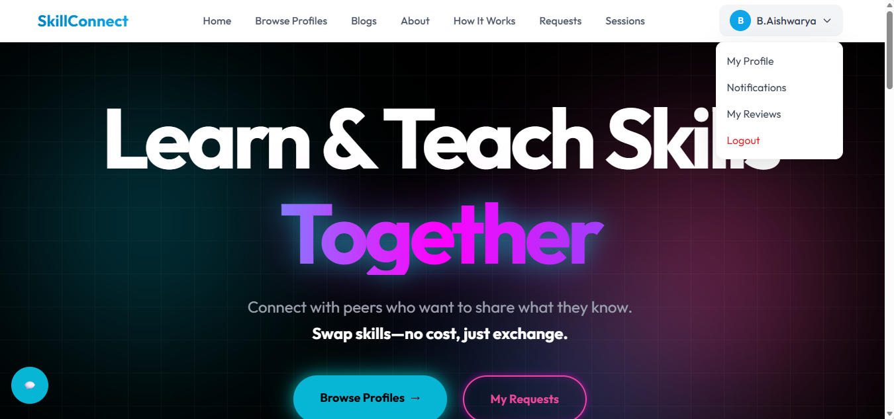
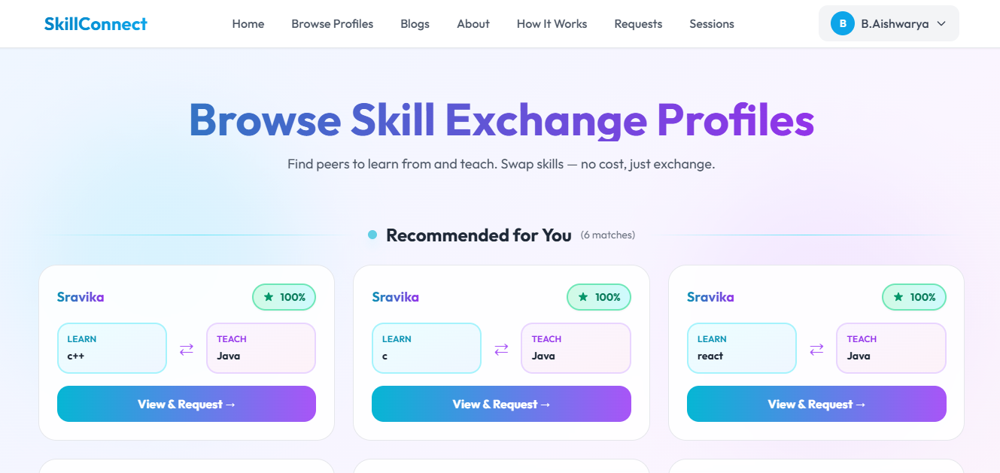
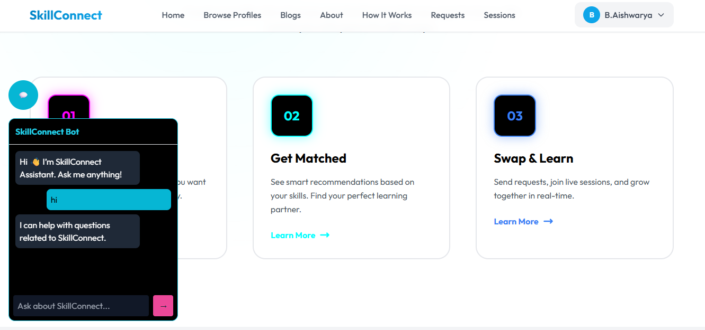
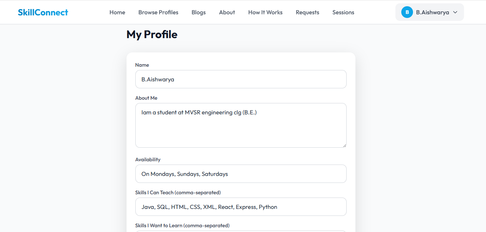
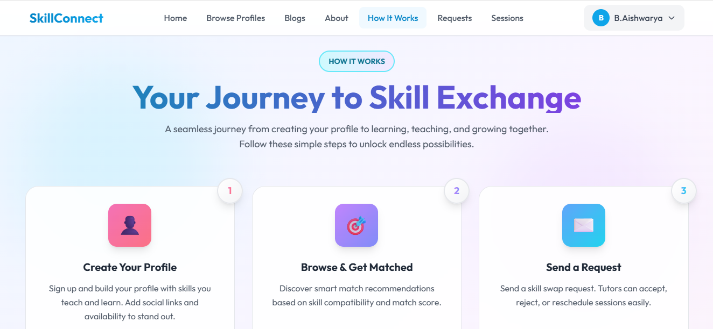
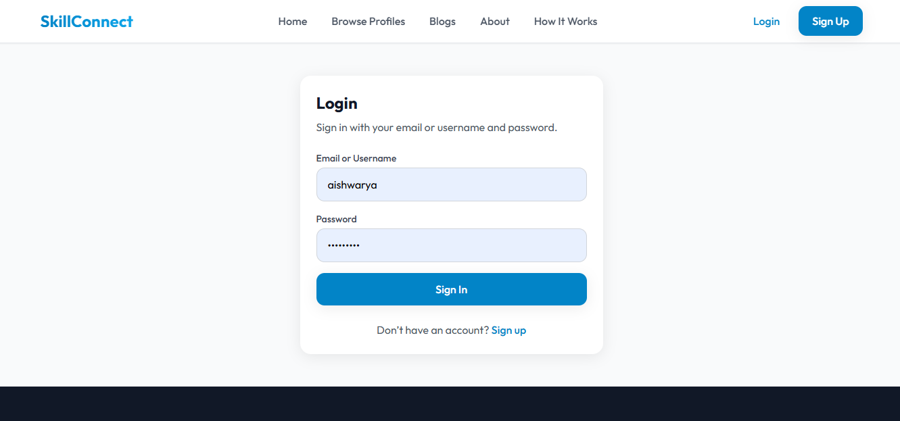
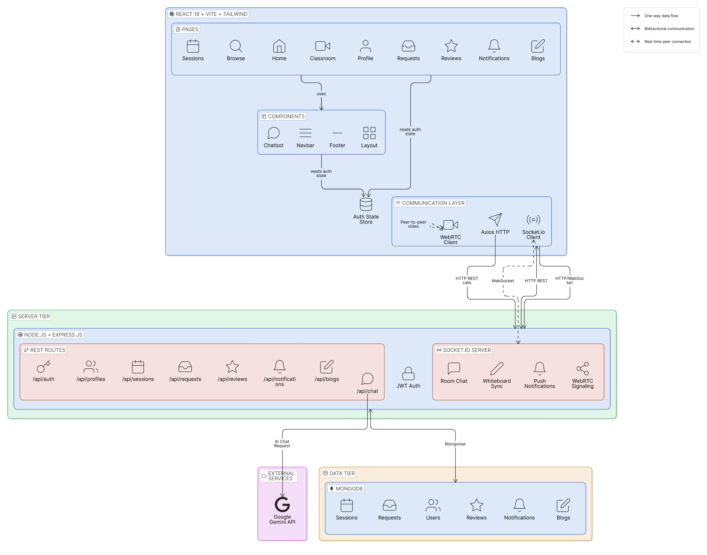

# SkillConnect 🎓

**SkillConnect** is a full-stack peer-to-peer skill-sharing platform that connects people who want to teach with people who want to learn. Users can list their skills, browse others, schedule live sessions, and collaborate in real-time — all in one place.

<!-- 🌐 Live Demo: [Add deployed link here] -->

---

## 📸 Screenshots

| Home Page | Browse Skills |
|-----------|---------------|
|  |  |

| Chat Bot | User Profile |
|----------------|--------------|
|  |  |

| How It Works | Login Page |
|----------------|--------------|
|  |  |

---

<!--## 🎬 Video Demo-->
<!-- [](https://your-video-link-here) -->

---

## ✨ Why SkillConnect?

- **Learn from peers, not just courses** — connect directly with people who have the skills you need.
- **Teach and earn reputation** — share your knowledge, get reviewed, and build a credible profile.
- **Real-time collaboration** — live classrooms come with video (WebRTC), whiteboard, and chat built in.
- **AI-powered assistant** — an integrated chatbot (powered by Gemini/OpenAI) helps users navigate and get answers instantly.
- **Full session lifecycle** — from requesting a skill → booking a session → joining a classroom → leaving a review, everything is handled end-to-end.
- **Instant notifications** — stay updated on requests, session changes, and messages in real time via Socket.io.

---

## 🚀 Features

- 🔐 JWT authentication with secure bcrypt password hashing
- 👤 User profiles with skills, bio, education, availability, and social links
- 🔍 Browse and search skill providers with match scores
- 📬 Send, accept, reject, or reschedule skill swap requests
- 📅 Schedule online or offline sessions with full status tracking
- 🎥 Live Classroom with WebRTC video/audio, shared whiteboard & real-time chat
- 📝 Knowledge tests — tutors can create MCQ assessments for learners post-session
- 🤖 AI Chatbot assistant (Google Gemini / OpenAI)
- ⭐ Review and rating system after completed sessions
- 🔔 Real-time in-app notifications via Socket.IO
- 📰 Community blog section for sharing knowledge

---

## 🏗️ System Architecture



The app follows a **3-tier architecture**:

- **Client Tier** — React frontend communicates with the server via REST (Axios) and WebSocket (Socket.io). WebRTC handles peer-to-peer video directly between users in the Classroom.
- **Server Tier** — Express.js processes API requests, manages JWT auth, handles all Socket.io events (chat, whiteboard, signaling, notifications), and calls the Google Gemini API for the AI chatbot.
- **Data Tier** — MongoDB stores all persistent data via Mongoose (Users, Profiles, Sessions, Requests, Reviews, Notifications, Blogs).

---

## 🛠️ Tech Stack

| Layer | Technology |
|-------|------------|
| **Frontend** | React 18, Vite, Tailwind CSS, React Router v6 |
| **State Management** | Zustand |
| **HTTP Client** | Axios |
| **Backend** | Node.js, Express.js |
| **Database** | MongoDB with Mongoose |
| **Real-time** | Socket.IO, WebRTC |
| **Auth** | JWT + bcrypt |
| **AI** | Google Gemini API |
| **Validation** | Zod, express-validator |
| **Forms** | React Hook Form |

---

## 📁 Project Structure

```
SkillConnect/
├── backend/
│   ├── src/
│   │   ├── config/
│   │   │   └── db.js               # MongoDB connection
│   │   ├── middleware/
│   │   │   └── auth.js             # JWT auth middleware
│   │   ├── models/
│   │   │   ├── User.js             # Auth credentials
│   │   │   ├── Profile.js          # Skills, bio, social links
│   │   │   ├── Request.js          # Skill swap requests
│   │   │   ├── Session.js          # Scheduled sessions
│   │   │   ├── Test.js             # MCQ assessments
│   │   │   ├── Review.js           # Session reviews
│   │   │   ├── Notification.js     # In-app notifications
│   │   │   └── Blog.js             # Community blog posts
│   │   ├── routes/
│   │   │   ├── auth.js             # Register / Login
│   │   │   ├── profiles.js         # Profile CRUD & search
│   │   │   ├── requests.js         # Skill swap request management
│   │   │   ├── sessions.js         # Session scheduling & status
│   │   │   ├── tests.js            # Test creation & attempts
│   │   │   ├── reviews.js          # Post-session reviews
│   │   │   ├── notifications.js    # Notification fetch & mark-read
│   │   │   └── blogs.js            # Blog CRUD
│   │   ├── services/
│   │   │   └── socketService.js    # Shared Socket.IO instance
│   │   └── server.js               # App entry point, Socket.IO handlers
│   ├── .env.example
│   └── package.json
│
├── frontend/
│   ├── public/
│   ├── src/
│   │   ├── api/
│   │   │   ├── axios.js            # Axios instance with auth header
│   │   │   └── socket.js           # Socket.IO client setup
│   │   ├── components/
│   │   │   ├── Navbar.jsx
│   │   │   ├── Footer.jsx
│   │   │   ├── Layout.jsx
│   │   │   └── Chatbot.jsx         # AI chatbot widget
│   │   ├── pages/
│   │   │   ├── Home.jsx
│   │   │   ├── Browse.jsx          # Search & filter profiles
│   │   │   ├── Profile.jsx         # View another user's profile
│   │   │   ├── MyProfile.jsx       # Edit own profile
│   │   │   ├── Requests.jsx        # Manage incoming/outgoing requests
│   │   │   ├── Sessions.jsx        # Session list
│   │   │   ├── SessionDetail.jsx   # Session info & actions
│   │   │   ├── Classroom.jsx       # Live video + whiteboard + chat
│   │   │   ├── Reviews.jsx
│   │   │   ├── Notifications.jsx
│   │   │   ├── Blogs.jsx
│   │   │   ├── BlogPost.jsx
│   │   │   ├── About.jsx
│   │   │   ├── HowItWorks.jsx
│   │   │   ├── Login.jsx
│   │   │   └── Signup.jsx
│   │   ├── store/
│   │   │   └── authStore.js        # Zustand auth store
│   │   ├── App.jsx                 # Routes definition
│   │   └── main.jsx
│   └── package.json
│
├── install-backend.bat
├── install-frontend.bat
├── run-backend.bat
└── run-frontend.bat
```

---

## ⚙️ Getting Started

### Prerequisites

- [Node.js](https://nodejs.org/) v18+
- A [MongoDB Atlas](https://www.mongodb.com/cloud/atlas) cluster (or local MongoDB instance)

### 1. Clone the repository

```bash
git clone https://github.com/your-username/SkillConnect.git
cd SkillConnect
```

### 2. Setup the Backend

```bash
cd backend
npm install
cp .env.example .env
```

Fill in your `.env`:

```env
PORT=5000
MONGODB_URI=your_mongodb_connection_string
JWT_SECRET=your_jwt_secret
NODE_ENV=development
CLIENT_ORIGIN=http://localhost:3000
```

> ⚠️ Never commit your `.env` file. It is already listed in `.gitignore`.

```bash
# Development (with auto-reload)
npm run dev

# Production
npm start
```

The server will run on `http://localhost:5000`.

### 3. Setup the Frontend

```bash
cd frontend
npm install
npm run dev
```

> 🪟 **Windows users:** Double-click the provided batch scripts in the root folder:
> 1. `install-backend.bat` — Installs backend dependencies
> 2. `install-frontend.bat` — Installs frontend dependencies
> 3. `run-backend.bat` — Starts the backend server
> 4. `run-frontend.bat` — Starts the frontend dev server

The app will be available at `http://localhost:5173` by default.

---

## 🔌 API Reference

All endpoints are prefixed with `/api`.

| Method | Endpoint | Auth | Description |
|--------|----------|------|-------------|
| `POST` | `/auth/register` | No | Register a new user |
| `POST` | `/auth/login` | No | Login and get JWT |
| `GET` | `/profiles` | No | Browse & search profiles |
| `GET` | `/profiles/:userId` | No | View a user's profile |
| `PUT` | `/profiles` | Yes | Update own profile |
| `POST` | `/requests` | Yes | Send a skill swap request |
| `GET` | `/requests` | Yes | Get incoming & outgoing requests |
| `PATCH` | `/requests/:id` | Yes | Accept / reject / reschedule |
| `POST` | `/sessions` | Yes | Create a session from accepted request |
| `GET` | `/sessions` | Yes | List user's sessions |
| `GET` | `/sessions/:id` | Yes | Get session details |
| `PATCH` | `/sessions/:id/status` | Yes | Update session status |
| `POST` | `/tests` | Yes | Create a test for a session |
| `POST` | `/tests/:id/attempt` | Yes | Submit test answers |
| `POST` | `/reviews` | Yes | Submit a session review |
| `GET` | `/notifications` | Yes | Fetch notifications |
| `PATCH` | `/notifications/:id/read` | Yes | Mark notification as read |
| `GET` | `/blogs` | No | List blog posts |
| `POST` | `/blogs` | Yes | Create a blog post |
| `POST` | `/chat` | Yes | AI chatbot endpoint |
| `GET` | `/health` | No | Server health check |

---

## 📡 Real-Time Events (Socket.IO)

Authentication is required via a JWT token passed in the socket handshake.

| Event | Direction | Description |
|-------|-----------|-------------|
| `join_notifications` | Client → Server | Subscribe to personal notification room |
| `join_room` | Client → Server | Join a classroom session room |
| `leave_room` | Client → Server | Leave a classroom session room |
| `chat_message` | Bidirectional | Send/receive in-session chat messages |
| `whiteboard_draw` | Bidirectional | Broadcast whiteboard strokes |
| `whiteboard_clear` | Bidirectional | Clear the shared whiteboard |
| `webrtc_offer` | Bidirectional | WebRTC connection offer |
| `webrtc_answer` | Bidirectional | WebRTC connection answer |
| `webrtc_ice` | Bidirectional | ICE candidate exchange |

---

## 🌐 Environment Variables

| Variable | Required | Description |
|----------|----------|-------------|
| `PORT` | No | Server port (default: `5000`) |
| `MONGODB_URI` | Yes | MongoDB connection string |
| `JWT_SECRET` | Yes | Secret key for signing JWTs |
| `NODE_ENV` | No | `development` or `production` |
| `CLIENT_ORIGIN` | No | Frontend URL for CORS (default: `http://localhost:3000`) |

---

## 🤝 Contributing

Contributions are always welcome! Whether it's fixing a bug, suggesting a feature, improving docs, or anything in between — feel free to open an issue or submit a pull request. Every contribution, big or small, is appreciated.

1. Fork the repo
2. Create your branch: `git checkout -b feature/your-feature`
3. Commit your changes: `git commit -m 'Add your feature'`
4. Push and open a PR

---

## 📄 License

This project is licensed under the [MIT License](LICENSE).
